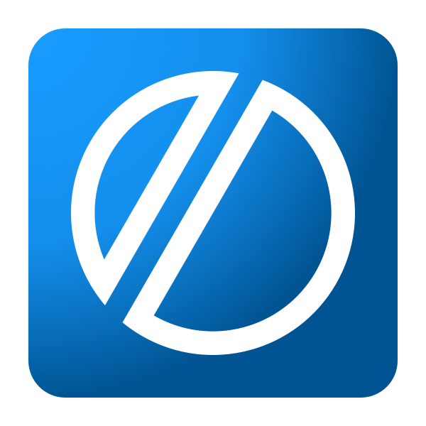

<h1 align="left">Siput Biru</h1>
<h3 align="left">A Computer Science Student that Learning about Graphics programming and little bit of recreational programming</h3>

---

> "The programmer, like the poet, works only slightly removed from pure thought-stuff. He builds his castles in the air, from air, creating by exertion of the imagination."
> — **Frederick P. Brooks Jr.**

---

### My Recreational Things

* [**sgl.h:**](https://github.com/SiputBiru/sgl.h) a single-header GPU batching layer for SDL3.
* [**sbgl:**](https://github.com/SiputBiru/sbgl) A C99 graphics framework/library with a mandate for Data-Oriented Design (DOD).
* [**eq2c-rs**](https://github.com/SiputBiru/eq2c-rs) a simple cli tools convert Equirectangular HDRI images into Cubemaps.
* [**sbl**](https://github.com/SiputBiru/sbl) STB-style single-header libraries written in C99.
* [**cangkang**](https://github.com/SiputBiru/cangkang) A simple and minimal SSG, written in Rust with zero dependencies.
* [**eqtui**](https://github.com/SiputBiru/eqtui) A simple and minimal terminal-based(TUI) audio equalizer built with Rust and Ratatui.

---

<h3 align="left">Languages and Tools that i usually use:</h3>

